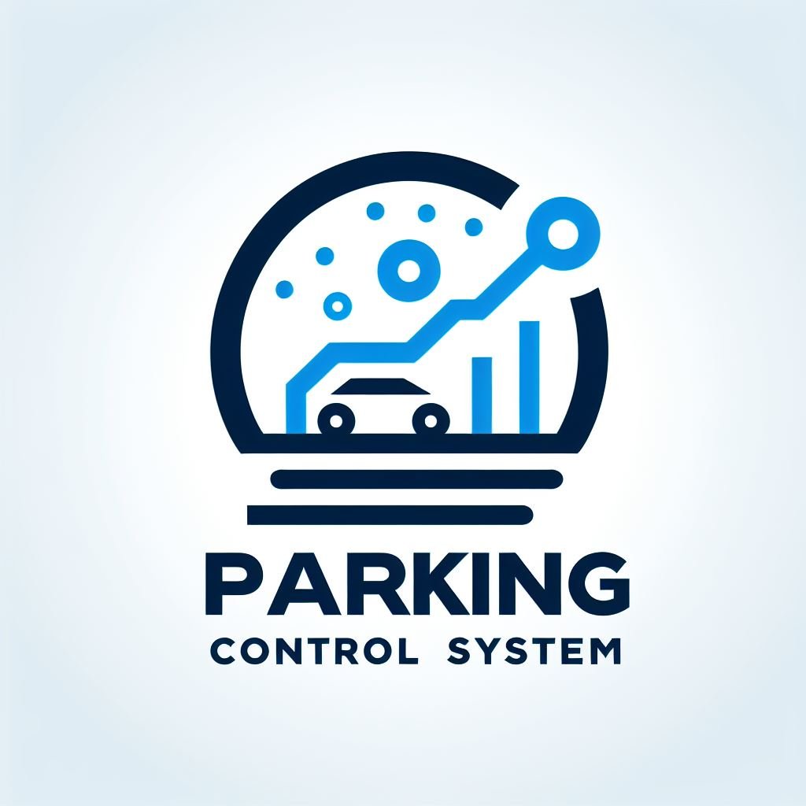
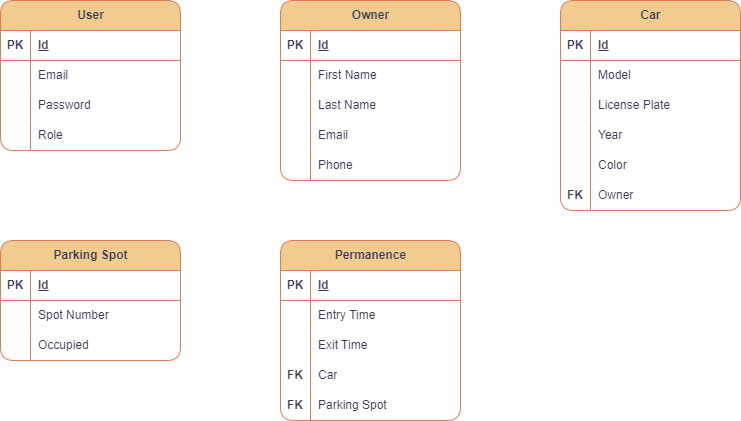

<h1 align="center"> 🎉 Sistema de Controle de Estacionamento 🚗 </h1>

<p align="center">
    
</p>

<p align="center">
    
    
    
    
    
</p>

<br />

<div align="center">
  <a href="https://github.com/rafaelmachadobr/ParkingControl">
    
  </a>

  <h3 align="center">Sistema de Controle de Estacionamento</h3>

  <p align="center">
    O Sistema de Controle de Estacionamento é uma aplicação de gerenciamento de estacionamentos que utiliza tecnologias de ponta para proporcionar uma experiência eficiente e moderna. Desenvolvido com Vite, TypeScript, ReactJS, TailwindCSS e Material UI no Frontend, e Java com Spring Boot no Backend, o sistema combina robustez e usabilidade.
    <br />
    <a href="https://github.com/rafaelmachadobr/ParkingControl"><strong>Explore a documentação »</strong></a>
    <br />
    <br />
    <a href="https://github.com/rafaelmachadobr/ParkingControl">Ver Demo</a>
    ·
    <a href="https://github.com/rafaelmachadobr/ParkingControl/issues">Relatar Bug</a>
    ·
    <a href="https://github.com/rafaelmachadobr/ParkingControl/issues">Solicitar Funcionalidades</a>
  </p>
</div>

<details>
  <summary>Sumário</summary>
  <ol>
    <li>
        <a href="#sobre-o-projeto">Sobre o Projeto</a>
    </li>
    <li>
        <a href="#tecnologias">Tecnologias</a>
    </li>
    <li>
        <a href="#pré-requisitos">Pré-requisitos</a>
    </li>
    <li>
        <a href="#instalação">Instalação</a>
        <ul>
            <li>
                <a href="#frontend">Frontend</a>
            </li>
            <li>
                <a href="#backend">Backend</a>
            </li>
        </ul>
    </li>
    <li>
        <a href="#diagrama-de-classes">Diagrama de Classes</a>
    </li>
    <li>
        <a href="#licença">Licença</a>
    </li>
    </ol>
</details>

## Sobre o Projeto

<p align="center">
    
</p>

> O Sistema de Controle de Estacionamento oferece uma solução eficiente para gerenciar e monitorar espaços de estacionamento. Desenvolvido com tecnologias modernas, o sistema proporciona uma experiência intuitiva tanto para os usuários quanto para os administradores.

## Tecnologias

Este projeto foi desenvolvido com as seguintes tecnologias:

- <a href="https://vitejs.dev/"></a>
- <a href="https://reactjs.org/"></a>
- <a href="https://www.typescriptlang.org/"></a>
- <a href="https://tailwindcss.com/"></a>
- <a href="https://www.java.com/"></a>
- <a href="https://spring.io/projects/spring-boot"></a>
- <a href="https://www.postgresql.org/"></a>

## Pré-requisitos

Antes de iniciar o desenvolvimento no Sistema de Controle de Estacionamento, certifique-se de ter as seguintes ferramentas instaladas em sua máquina:

- <a href="https://git-scm.com/"></a>
- <a href="https://nodejs.org/en/"></a>
- <a href="https://www.npmjs.com/"></a>
- <a href="https://www.java.com/"></a>
- <a href="https://www.postgresql.org/"></a>

Além disto é bom ter um editor para trabalhar com o código como <a href="https://code.visualstudio.com/">VSCode</a> ou <a href="https://www.jetbrains.com/pt-br/idea/">IntelliJ IDEA</a>.

## Instalação

Clone o repositório

```bash
git clone https://github.com/rafaelmachadobr/ParkingControl.git
```

Acesse a pasta do projeto no terminal/cmd

```bash
cd ParkingControl
```

### Frontend

Vá para a pasta frontend

```bash
cd frontend
```

Instale as dependências

```bash
npm install
```

Execute a aplicação

```bash
npm run dev
```

A aplicação será aberta na porta:`3000` - acesse <a href="http://localhost:3000">http://localhost:3000</a>

### Backend

Vá para a pasta backend

```bash
cd backend
```

Execute a aplicação

```bash
./mvnw spring-boot:run
```

A aplicação será aberta na porta:`8080` - acesse <a href="http://localhost:8080">http://localhost:8080</a>

## Diagrama UML

A seguir, apresentamos o diagrama UML que ilustra a estrutura e as relações entre as principais entidades do Sistema de Controle de Estacionamento. Este diagrama oferece uma visão abrangente da organização do sistema, facilitando a compreensão das interações entre os diferentes componentes.

<p align="center">
    
</p>

## Licença

Este projeto está sob a licença MIT. Veja o arquivo <a href="LICENSE">`LICENSE`</a> para mais detalhes.
